# unity作业-AI tank

视频演示链接：[unity作业-坦克大战-其他-高清完整正版视频在线观看-优酷](https://v.youku.com/v_show/id_XNTkyNjE4MzE5Ng==.html)

（虽然演示中看起来玩家根本没法与AI坦克抗衡，实际上我自己打的时候是可以打通过的，但需要利用地形去绕，时长过长，就不放入视频中了。演示视频中只是简单的演示一下游戏内容）

## 题目

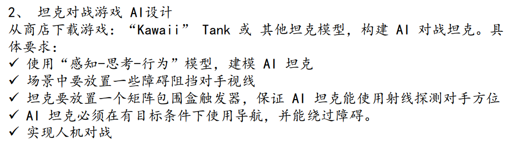

## 游戏简介

在一个小镇地图中，玩家操控一台虎式坦克（tiger），与地图中其他10个AI操控的谢尔曼萤火虫坦克（Firefly）对战。AI坦克会追踪玩家并尝试击杀玩家，玩家需要存活并击杀它们。

## 资源导入与环境搭建

从asset store中下载Kawaii Tank资源，然后导入到项目中，如图。

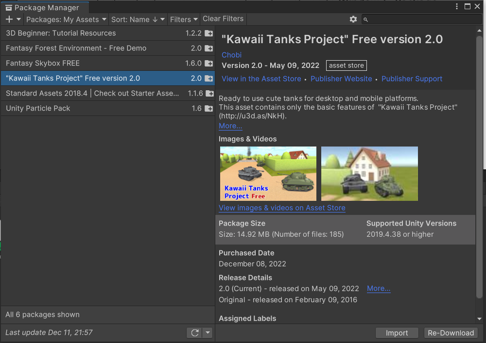

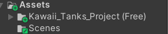

Kawaii Tanks中给了两个演示场景，这里我们使用了较复杂的town作为基础，然后在此基础上去掉了一些挡板（实战中发现，挡板过多会影响游戏性），放入玩家和敌方坦克。最终得到的场景如下（这里坦克在空中是模拟“从天而降”的效果）。

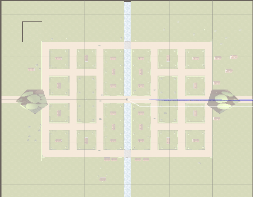

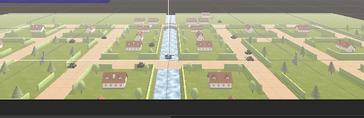

然后，我们需要设置导航。点击windows-AI-navigation，我们就可以对此进行调节。

选取全体地形并如下设置，选取障碍物并将它们设为Not Walkable。然后进行bake，为AI提供寻路导航。

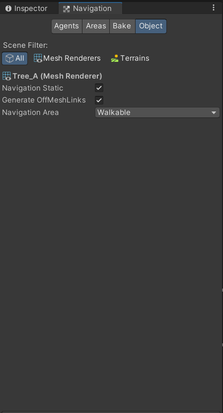

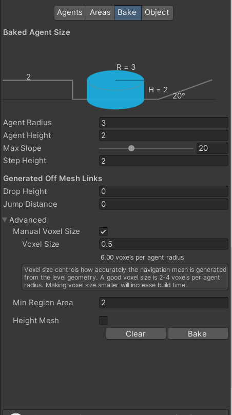

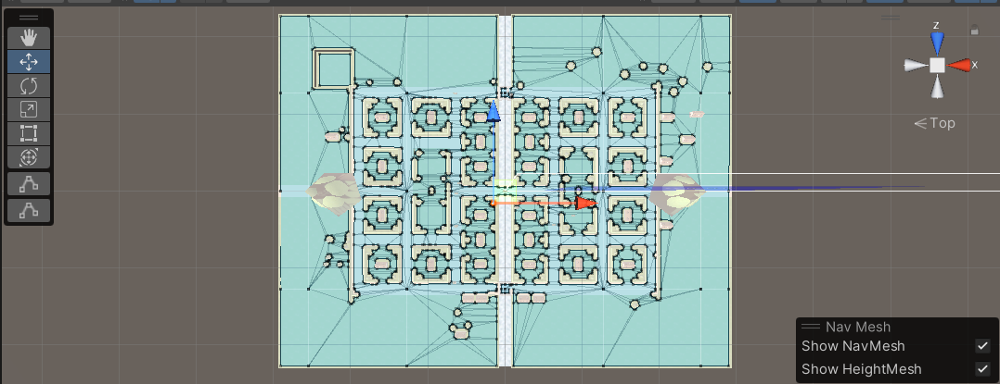

AI坦克的mainbody部分都需要加上nav mesh agent

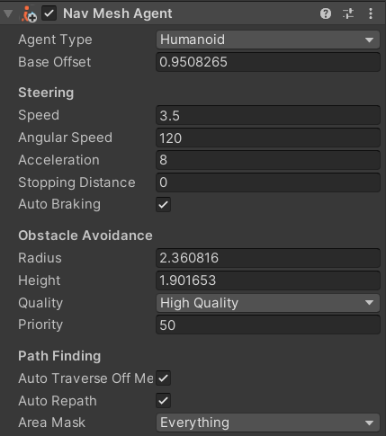

### 代码部分

为AI坦克的mainbody加上aI_action代码，代码如下。

```csharp
using System.Collections;
using System.Collections.Generic;
using UnityEngine;
using UnityEngine.AI;

public class ai_action : MonoBehaviour
{
    public GameObject target; 
    NavMeshAgent navMeshAgent;
    void Start()
    {
        navMeshAgent = GetComponent<NavMeshAgent>();
    }

    void Update()
    {
        navMeshAgent.SetDestination(target.transform.position);
    }
}
```

这里的target需要手动指定为玩家坦克的mainbody。

在Fire_Control_CS修改AI坦克的开火，将其射速指定为每3秒发射一次。

```csharp
            if (isSelected){
                inputScript.Get_Input();
            }
            else{
                count = count + Time.deltaTime;
                if(count > 3.0f)
                {
                    Fire();
                    count = 0.0f;
                }
            }
```

然后，我们还需要修改AI坦克的消失方式。因为提供的坦克代码中，坦克被摧毁后不是直接消失，而是转为被摧毁的状态，留下残骸，但是在实际游戏中，坦克残骸也会去追踪玩家，因此需要将AI坦克改成消失，不能留下残骸。为此，修改Damage_Control_CS中的Start_Destroying函数，如下。

```csharp
        void Start_Destroying()
        {
            // Set the dead flag.
            isDead = true;
            if(!isSelected){
                this.gameObject.SetActive(false);

            }
            Debug.Log("destroy");
           // Send message to all the parts.
            transform.root.BroadcastMessage("Destroyed_Linkage", SendMessageOptions.DontRequireReceiver);
            // Create destroyedPrefab.
            if (destroyedPrefab){
                GameObject tmp = Instantiate (destroyedPrefab, bodyTransform.position, Quaternion.identity) as GameObject;
                tmp.transform.parent = bodyTransform;
            }
            // Remove the Damage text.
            if (displayScript){
                Destroy (displayScript.gameObject);
            }
            // Destroy this script.
            Destroy (this);
        }
```

为了适配游戏，其他部分的代码也做了很多小更改（例如瞄准部分），比较细碎，因此这里就不展示了。

## 部分实战演示（完整演示见视频）

游戏会在左侧显示按键提示，显示本坦克的血量，如图。

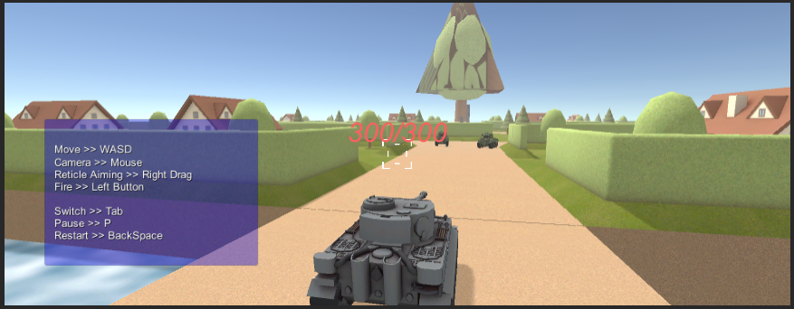

当击中对方坦克时，如果没击杀，会显示对方坦克的剩余血量。

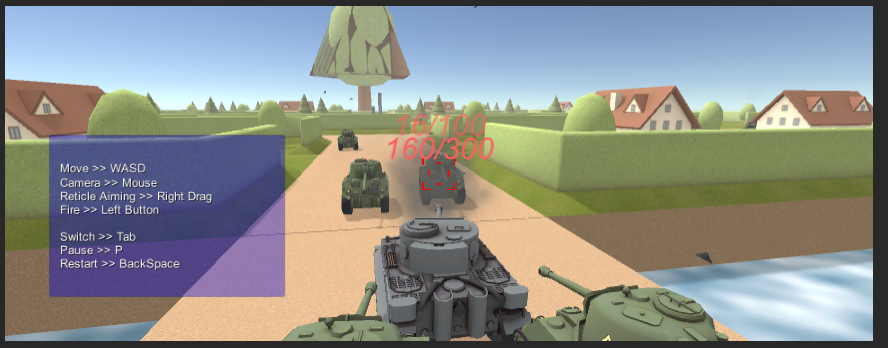

如果坦克掉出地图（如掉入水中），坦克被摧毁，游戏失败。

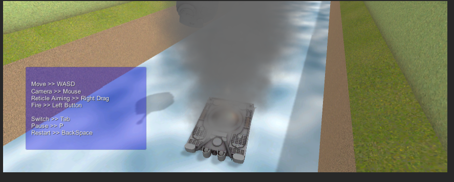
